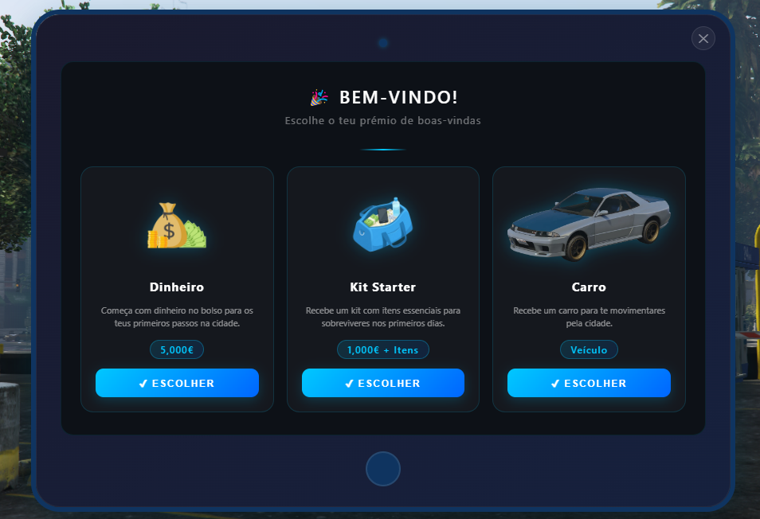

# QB Welcome Rewards 🎁



## 🇵🇹 Descrição (PT-PT)

Script para **prémio de boas-vindas à sua cidade!**
Quando os civis entrarem na cidade, devem utilizar o comando `/welcome` e uma interface moderna em forma de tablet abrirá. Após a abertura, o jogador poderá escolher o prémio que mais lhe agrada entre as opções disponíveis.

### ✨ Funcionalidades principais

- **Comando Único:** `/welcome` para abrir a interface de prémios.
- **Design Moderno:** Tablet responsivo que suporta de 1 até 6 prémios em simultâneo.
- **Tipos de Prémios:** Suporte para Dinheiro (Bank), Itens, Carros e Bundles (combinação de vários benefícios).
- **Segurança:** O script verifica na base de dados e apenas permite resgatar o prémio **uma única vez** por cidadão.
- **Integração de Garagem:** Baseado no sistema do `qb-vehicleshop` para gerar matrículas e adicionar os carros diretamente à garagem do jogador (`player_vehicles`).

### ⚙️ Configuração

Toda a lógica de prémios, descrições, imagens e quantidades pode ser alterada facilmente no ficheiro `config.lua`.

---

## 🇬🇧 Description (EN-EN)

Welcome reward script for **your FiveM server!**
When civilians join the city, they can use the `/welcome` command to open a modern tablet-style UI. Once opened, the player can choose their preferred welcome gift from the available options.

### ✨ Main Features

- **Single Command:** `/welcome` to trigger the rewards interface.
- **Modern Design:** Responsive tablet UI that supports from 1 up to 6 rewards at once.
- **Reward Types:** Support for Money (Bank), Items, Cars, and Bundles (a combination of multiple rewards).
- **Security:** The script checks the database to ensure each player can only redeem a reward **once**.
- **Garage Integration:** Based on `qb-vehicleshop` logic to generate plates and add vehicles directly to the player's garage (`player_vehicles`).

### ⚙️ Configuration

All reward logic, descriptions, images, and amounts can be easily customized in the `config.lua` file.

---

## 🛠️ Instalação / Installation

### 🇵🇹 PT-PT

1. Extraia a pasta `qb-welcome` para o seu diretório de `resources`.
2. Importe o ficheiro SQL para a sua base de dados:

```sql
CREATE TABLE IF NOT EXISTS `welcome_rewards` (
    `id` INT AUTO_INCREMENT PRIMARY KEY,
    `identifier` VARCHAR(60) NOT NULL,
    `prize` INT NOT NULL,
    `redeemed_at` DATETIME DEFAULT CURRENT_TIMESTAMP
);
```

3. Adicione as imagens dos seus prémios na pasta `html/img/` (certifique-se que o nome no `config.lua` corresponde ao nome do ficheiro).
4. Reinicie o servidor.

### 🇬🇧 EN-EN

1. Extract the `qb-welcome` folder into your `resources` directory.
2. Import the SQL file into your database:

```sql
CREATE TABLE IF NOT EXISTS `welcome_rewards` (
    `id` INT AUTO_INCREMENT PRIMARY KEY,
    `identifier` VARCHAR(60) NOT NULL,
    `prize` INT NOT NULL,
    `redeemed_at` DATETIME DEFAULT CURRENT_TIMESTAMP
);
```

3. Add your prize images to the `html/img/` folder (make sure the names match those defined in `config.lua`).
4. Restart the server.

---

## 📞 Suporte / Support

Caso necessite de suporte técnico ou pretenda solicitar alterações personalizadas, entre em contacto através do Discord:
If you need technical support or want to request custom changes, feel free to contact us on Discord:

👉 **[https://discord.gg/uGaj9GK7pYR](https://discord.gg/uGaj9GK7pY)**

---
## Pay What You Want: [paypal.me/pedrodaniel2002](https://www.paypal.com/paypalme/pedrodaniel2002)
---

*Desenvolvido para a comunidade QBCore FiveM. / Developed for the QBCore FiveM community.*